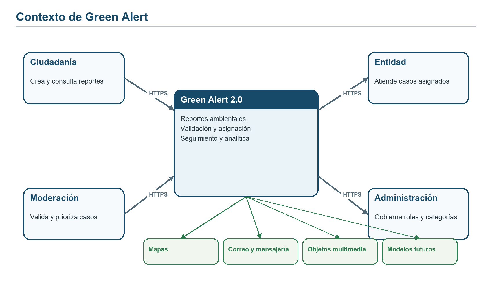
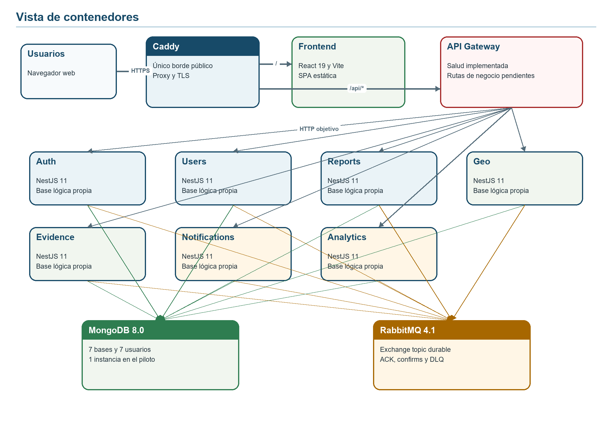
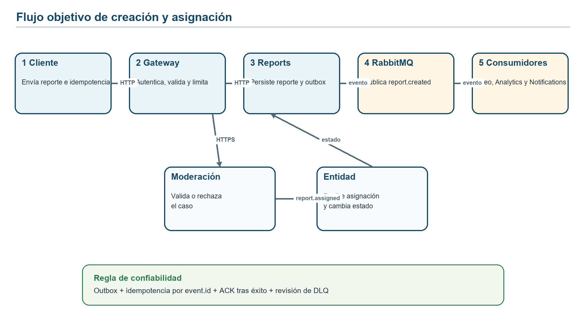
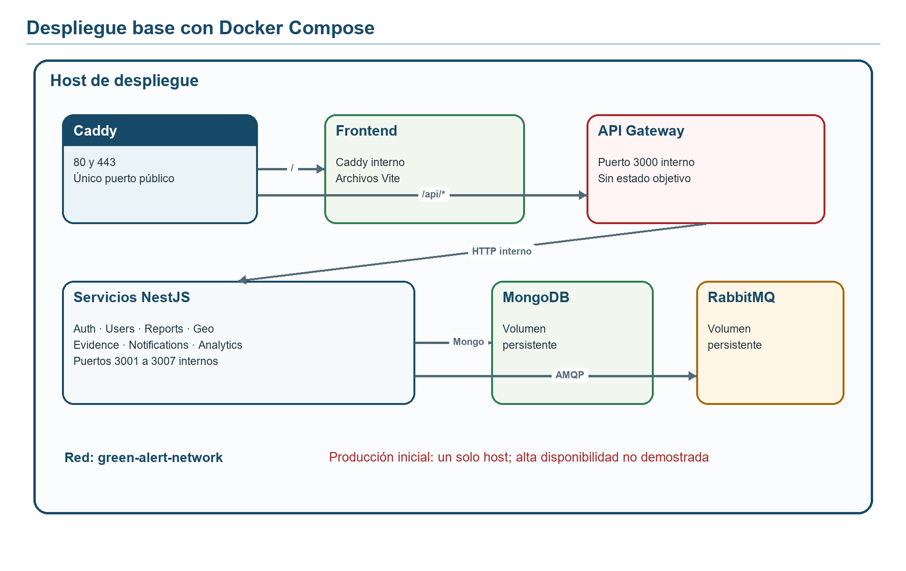

# Documento de arquitectura de software Green Alert 2.0

**Versión:** 1.0  
**Fecha de corte:** 10 de septiembre de 2026  
**Estado:** Línea base de las etapas 1 a 3 y arquitectura objetivo para las etapas siguientes  
**Autores:** Puticos CORP
**Institución:** Institución Universitaria del Putumayo  
**Programa:** Ingeniería en Sistemas  
**Asignatura:** Arquitectura de Software

## Resumen

Este documento describe la arquitectura de Green Alert 2.0, una plataforma orientada al registro, seguimiento y análisis de incidentes ambientales. La solución busca conectar a la ciudadanía con moderadores y entidades responsables mediante reportes georreferenciados, evidencias, asignaciones, cambios de estado, notificaciones y análisis. La línea base examinada corresponde al repositorio en su rama `main` al 10 de septiembre de 2026: un monorepo con ocho aplicaciones NestJS, un frontend React con Vite, siete bases lógicas en MongoDB, mensajería RabbitMQ, contenerización con Docker Compose y publicación mediante Caddy.

El análisis evita confundir la estructura desplegable con un producto terminado. En el corte actual solo están implementados el arranque de los procesos, la configuración común, la conexión a infraestructura, la salud HTTP y librerías transversales; el API Gateway no enruta operaciones de negocio y los módulos de dominio aún son esqueletos. Por ello, el documento diferencia tres estados: **implementado**, **decidido pero pendiente** y **propuesto para evolución**. La arquitectura se razona mediante una aplicación acotada de Attribute-Driven Design, denominada Mini-ADD en este proyecto, que relaciona requisitos arquitectónicamente significativos, escenarios de calidad, tácticas, responsabilidades, interfaces y riesgos. El resultado confirma la coherencia de la separación por capacidades, pero también identifica que siete microservicios introducen un costo operativo considerable para un piloto. Se conserva esa decisión por su presencia en el repositorio y se condiciona su éxito a automatización, observabilidad, contratos explícitos y despliegues independientes.

**Palabras clave:** arquitectura de software, Mini-ADD, microservicios, NestJS, MongoDB, RabbitMQ, Green Alert.

## 1 Introducción

### 1.1 Propósito

El propósito del SAD es proporcionar una descripción verificable de las decisiones que organizan Green Alert 2.0 y de las razones que las sustentan. Sirve como referencia para el equipo de desarrollo, docentes, responsables institucionales, operadores y futuros mantenedores. No sustituye los requisitos funcionales detallados, los contratos OpenAPI, los modelos de datos ni los manuales de operación; establece el marco dentro del cual esos artefactos deben evolucionar.

La descripción adopta conceptos de ISO/IEC/IEEE 42010:2022 al identificar el sistema de interés, sus interesados, preocupaciones, puntos de vista y correspondencia entre vistas. La norma distingue la arquitectura de su descripción y no prescribe una notación específica (International Organization for Standardization [ISO], 2022). Para razonar las decisiones se usa ADD, método que parte de funcionalidad, atributos de calidad y restricciones y selecciona conceptos de diseño que respondan a esos impulsores (Wojcik et al., 2006). La versión Mini-ADD conserva ese hilo, pero limita las iteraciones a los elementos con mayor impacto en el corte académico.

### 1.2 Alcance

El documento cubre:

- contexto, interesados y objetivos de negocio;
- estado real del repositorio y límites de la evidencia disponible;
- requisitos funcionales principales, escenarios de calidad y restricciones;
- descomposición en aplicaciones, servicios, librerías, almacenes y broker;
- vistas de contexto, contenedores, componentes, ejecución, datos, seguridad y despliegue;
- interfaces síncronas y asíncronas esperadas;
- decisiones arquitectónicas, alternativas, consecuencias y deuda técnica;
- estrategia de verificación y hoja de ruta.

Quedan fuera del alcance el diseño visual definitivo, los modelos de aprendizaje automático, la contratación de infraestructura en nube, la selección de una entidad concreta de almacenamiento de objetos, la topología de alta disponibilidad y los acuerdos de nivel de servicio institucionales. Estos asuntos requieren información de carga, presupuesto, regulación y operación que no está registrada en el repositorio.

### 1.3 Convenciones de estado

| Estado                  | Significado en este documento                                                                                                             |
| ----------------------- | ----------------------------------------------------------------------------------------------------------------------------------------- |
| Implementado            | Existe código o configuración verificable en el repositorio y, cuando aplica, pruebas automatizadas.                                      |
| Decidido pero pendiente | La decisión es coherente con la estructura actual y se adopta como dirección, pero faltan controladores, esquemas, integración o pruebas. |
| Propuesto               | Es una opción de evolución que requiere validación adicional antes de convertirse en compromiso.                                          |

### 1.4 Fuentes de evidencia

La fuente primaria es el repositorio `Pituquinos/Green-Alert`, incluyendo `readme.md`, `docs/architecture.md`, `docs/validation.md`, `package.json`, Docker Compose, Caddy, las aplicaciones de `apps/`, las librerías de `libs/`, los contratos de eventos y el flujo de integración continua. Las fuentes externas se usan para sustentar el método y las propiedades de las tecnologías, no para afirmar que una capacidad ya se encuentra implementada.

## 2 Contexto y objetivos

### 2.1 Problema

Los incidentes ambientales suelen comunicarse mediante canales fragmentados, con información incompleta, poca precisión geográfica y escasa trazabilidad entre el reporte inicial y la actuación institucional. Green Alert busca convertir esa comunicación en un caso gestionable: una persona registra el incidente, aporta ubicación y evidencia, un moderador valida la información, una entidad recibe la asignación, el estado evoluciona de forma auditable y las partes interesadas reciben notificaciones y resultados agregados.

### 2.2 Objetivos de negocio

1. Facilitar el registro de incidentes ambientales con contexto geográfico y evidencia verificable.
2. Reducir la pérdida de información durante la validación, asignación y seguimiento institucional.
3. Mantener trazabilidad de estados, responsables y eventos relevantes.
4. Proporcionar información agregada para reconocer zonas, categorías y recurrencias.
5. Permitir la evolución gradual hacia clasificación automática de evidencia y predicción, sin acoplar desde ahora el núcleo transaccional a una tecnología de inteligencia artificial.

### 2.3 Interesados y preocupaciones

| Interesado             | Preocupaciones principales                                                 | Vista que responde                     |
| ---------------------- | -------------------------------------------------------------------------- | -------------------------------------- |
| Ciudadanía             | Facilidad de reporte, privacidad, confirmación y seguimiento               | Contexto, ejecución y seguridad        |
| Moderadores            | Calidad de la información, validación, rechazo justificado y priorización  | Funcional, datos y ejecución           |
| Entidades responsables | Asignación clara, estados, evidencia disponible y trazabilidad             | Componentes, interfaces y datos        |
| Administradores        | Roles, categorías, configuración, auditoría y continuidad                  | Seguridad, datos y despliegue          |
| Equipo de desarrollo   | Límites de servicio, contratos, capacidad de prueba y cambio independiente | Contenedores, componentes y decisiones |
| Operaciones            | Salud, logs, alertas, recuperación, secretos y despliegue repetible        | Despliegue, operación y riesgos        |
| Docente o evaluador    | Coherencia entre requisitos, atributos de calidad, tácticas y evidencia    | Mini-ADD, trazabilidad y verificación  |

### 2.4 Contexto del sistema

Green Alert recibe solicitudes de ciudadanos, moderadores, entidades y administradores por una interfaz web. La integración con correo, mensajería móvil, mapas, almacenamiento de objetos y modelos de inteligencia artificial pertenece a la arquitectura objetivo y requiere adaptadores explícitos. Esos sistemas externos no deben obtener acceso directo a las bases de datos internas.

## 3 Estado real de la solución

### 3.1 Línea base implementada

El repositorio contiene ocho aplicaciones NestJS arrancables: API Gateway, Auth, Users, Reports, Geo, Evidence, Notifications y Analytics. Siete servicios de dominio cargan configuración, conexión Mongoose, conexión RabbitMQ y un módulo de salud. El gateway carga configuración y salud, pero todavía no importa clientes, controladores de negocio ni mecanismos de enrutamiento hacia los demás servicios. El frontend React consulta únicamente `/api/v1/health` y presenta el estado del gateway.

Las librerías compartidas ofrecen validación de entorno, bootstrap HTTP, manejo seguro de excepciones, tipos y eventos, conexión a MongoDB, publicación y consumo de mensajes, hashing bcrypt y guardas JWT/roles. La presencia de una clase o guarda compartida no significa que esté aplicada en endpoints, porque esos endpoints todavía no existen.

### 3.2 Infraestructura implementada

Docker Compose declara doce contenedores: Caddy de entrada, frontend, ocho procesos NestJS, MongoDB y RabbitMQ. Solo Caddy publica puertos en la configuración base. Los servicios de dominio esperan a que MongoDB y RabbitMQ reporten salud antes de iniciarse; Docker documenta que `depends_on` con `service_healthy` espera el resultado del `healthcheck` y no solo la creación del contenedor (Docker, s. f.). El entorno dispone de volúmenes persistentes para MongoDB, RabbitMQ y el estado de Caddy.

MongoDB se ejecuta como una instancia con siete bases y siete usuarios `readWrite`, uno por servicio. La separación es lógica y de credenciales; no equivale a siete clústeres ni ofrece aislamiento físico ante la caída de la instancia. RabbitMQ dispone de un exchange `topic` durable para eventos, publicación persistente confirmada, `ack` manual, `prefetch` y colas de mensajes muertos por consumidor. Las confirmaciones del publicador y los acuses del consumidor cumplen funciones distintas para la seguridad de entrega (RabbitMQ, s. f.).

### 3.3 Cobertura funcional actual

| Capacidad                                    | Estado                              | Evidencia o brecha                                                                       |
| -------------------------------------------- | ----------------------------------- | ---------------------------------------------------------------------------------------- |
| Arranque y salud de ocho aplicaciones        | Implementado                        | `main.ts`, módulos de aplicación y prueba de integración de salud                        |
| Configuración, validación y secretos locales | Implementado                        | `libs/config`, `.env.example` y `scripts/init-env.mjs`                                   |
| Conexión aislada a MongoDB                   | Implementado en infraestructura     | Una URI y usuario por servicio; faltan esquemas de dominio                               |
| Publicación y consumo de eventos             | Implementado como librería          | Pruebas unitarias; no hay consumidores de negocio registrados                            |
| Seguridad JWT y roles                        | Implementado como librería          | Falta emisión de tokens y aplicación en rutas reales                                     |
| Registro, login, refresh y logout            | Pendiente                           | AuthModule vacío y login retorna 404                                                     |
| Gestión de usuarios                          | Pendiente                           | UsersModule vacío                                                                        |
| Reportes, categorías y asignaciones          | Pendiente                           | Módulos declarados sin controladores ni persistencia                                     |
| Georreferenciación                           | Pendiente                           | Contrato GeoJSON mínimo; sin colección ni índice `2dsphere`                              |
| Evidencias multimedia                        | Pendiente                           | Sin API ni almacenamiento de objetos                                                     |
| Notificaciones y analítica                   | Pendiente                           | Módulos vacíos; existen contratos de eventos iniciales                                   |
| Despliegue completo en contenedores          | Configurado, no validado localmente | Compose y Caddy fueron validados; el arranque real depende de CI o de un host con Docker |

### 3.4 Suposiciones sometidas a revisión

La primera suposición riesgosa es que dividir el sistema en siete servicios de dominio garantiza escalabilidad. La división solo aporta valor cuando las capacidades necesitan ciclos de cambio, escalado o aislamiento distintos; de lo contrario, aumenta despliegues, fallos parciales, trazas distribuidas y consistencia eventual. El repositorio ya materializa esa separación, por lo que el SAD no la revierte, pero exige métricas que permitan consolidar límites si el costo supera el beneficio.

La segunda suposición es que “una base por servicio” produce independencia total. Todos los datos se alojan hoy en una única instancia MongoDB, de modo que se limita el acceso lógico pero se comparte capacidad, mantenimiento y punto de falla. La independencia real de disponibilidad requeriría réplicas, respaldos probados y, si el riesgo lo justifica, separación física.

La tercera suposición es que MongoDB debe almacenar también fotografías y videos. El modelo documental es adecuado para metadatos flexibles, pero los binarios grandes elevan costos de respaldo y transferencia. La arquitectura objetivo conserva metadatos y referencias en Evidence y usa almacenamiento de objetos para el contenido.

La cuarta suposición es que añadir Python o Java mejora automáticamente el sistema. En el estado actual introducir nuevos lenguajes duplicaría toolchains, imágenes, observabilidad y conocimiento operativo. Python se justifica solo cuando aparezca una carga real de modelos o procesamiento científico; Java no tiene un impulsor identificado en el corte actual.

## 4 Requisitos arquitectónicamente significativos

### 4.1 Funcionalidad primaria

- **RF-01 Identidad:** registrar usuarios, autenticar credenciales, emitir y renovar sesiones y aplicar roles `CITIZEN`, `MODERATOR`, `ENTITY` y `ADMIN`.
- **RF-02 Reporte:** crear un reporte con título, categoría, descripción, autor, ubicación GeoJSON y referencias de evidencia.
- **RF-03 Moderación:** validar o rechazar un reporte con motivo y actor responsable.
- **RF-04 Asignación:** asociar reportes validados a una entidad responsable y registrar cambios de estado.
- **RF-05 Evidencia:** cargar, consultar y retirar evidencia con metadatos, integridad, tipo y política de acceso.
- **RF-06 Geografía:** consultar incidentes por proximidad, área o intersección y producir agregados territoriales.
- **RF-07 Notificación:** informar eventos relevantes sin bloquear la transacción que los originó.
- **RF-08 Analítica:** construir proyecciones y métricas a partir de eventos, sin consultar directamente la base de Reports.
- **RF-09 Auditoría:** conservar actor, instante, correlación y transición para las operaciones sensibles.

### 4.2 Escenarios de atributos de calidad

Los valores siguientes son objetivos de aceptación, no resultados medidos. Deben revisarse con el docente, usuarios piloto y capacidad de infraestructura antes de considerarlos acuerdos de servicio.

| ID    | Atributo                   | Escenario y respuesta esperada                                                                                                                      | Medida y estado                                                                                                                                  |
| ----- | -------------------------- | --------------------------------------------------------------------------------------------------------------------------------------------------- | ------------------------------------------------------------------------------------------------------------------------------------------------ |
| EC-01 | Seguridad                  | Un cliente externo intenta acceder a MongoDB, RabbitMQ o un servicio interno en producción; la red rechaza el acceso y solo Caddy expone 80/443.    | Cero puertos internos publicados. Parcialmente implementado.                                                                                     |
| EC-02 | Seguridad                  | Un usuario sin token o con rol insuficiente solicita una operación protegida; el gateway o servicio devuelve 401/403 sin filtrar detalles internos. | 100 % de rutas protegidas con guardas y pruebas. Pendiente de endpoints.                                                                         |
| EC-03 | Disponibilidad             | Un servicio de dominio termina inesperadamente; Compose intenta reiniciarlo y las capacidades no dependientes continúan disponibles.                | Detección dentro del ciclo de salud y recuperación comprobada en prueba de caos. Configuración parcial.                                          |
| EC-04 | Confiabilidad              | Un consumidor falla después de recibir un evento; el mensaje no se pierde silenciosamente y queda disponible para reentrega o revisión.             | `ack` solo tras éxito; error a DLQ; idempotencia por `event.id`. Librería parcial, negocio pendiente.                                            |
| EC-05 | Modificabilidad            | Se cambia la lógica de notificaciones sin modificar esquemas ni desplegar Reports.                                                                  | Cambio contenido en Notifications y sus contratos versionados; prueba de contrato obligatoria. Estructura preparada.                             |
| EC-06 | Rendimiento                | Cien usuarios concurrentes consultan reportes paginados en una operación normal; la API responde sin cargar evidencia binaria.                      | p95 menor o igual a 2 s y tasa de error menor a 1 % en ambiente acordado. Por validar.                                                           |
| EC-07 | Escalabilidad              | Aumenta el volumen de eventos de reportes; se agregan réplicas de Analytics o Notifications.                                                        | Las réplicas comparten cola de consumidor, no duplican una misma proyección y mantienen rezago bajo el umbral acordado. Pendiente.               |
| EC-08 | Observabilidad             | Un reporte atraviesa gateway, Reports, broker y Notifications; soporte investiga un fallo.                                                          | La misma correlación aparece en logs estructurados y evento; trazado recuperable en menos de 10 min. CorrelationId existe, telemetría pendiente. |
| EC-09 | Recuperación               | Se pierde el contenedor o nodo de MongoDB; operaciones restauran datos desde respaldo.                                                              | RPO y RTO definidos institucionalmente y restauración ensayada al menos trimestralmente. No implementado.                                        |
| EC-10 | Usabilidad y accesibilidad | Una persona completa el reporte desde móvil con conectividad inestable.                                                                             | Borrador local, mensajes comprensibles, reintento seguro y conformidad WCAG acordada. No implementado.                                           |

### 4.3 Restricciones

1. El repositorio usa Node.js 22, NestJS 11, TypeScript estricto y React 19 con Vite.
2. La infraestructura base se expresa con Docker Compose y el borde HTTP con Caddy.
3. MongoDB 8.0 es el gestor persistente actual; cada servicio de dominio recibe solo su URI.
4. RabbitMQ 4.1 es el broker y el exchange de dominio es `greenalert.events`.
5. Los contratos compartidos no deben incluir esquemas Mongoose ni secretos.
6. El frontend y las APIs se publican bajo el mismo origen a través de Caddy.
7. Ningún resultado de validación local puede tratarse como prueba de producción.
8. Las evidencias y datos personales deben recibir políticas de acceso, retención y eliminación antes del piloto.

### 4.4 Preocupaciones transversales

La consistencia entre servicios, la idempotencia, los secretos, la autorización por objeto, la trazabilidad, la evolución de eventos, la privacidad de ubicación y evidencia, el respaldo y la operación de mensajes muertos afectan múltiples capacidades y no pueden resolverse dentro de un único módulo. Se tratan como decisiones arquitectónicas y criterios de aceptación.

## 5 Aplicación de Mini-ADD

El método ADD propone seleccionar un elemento, priorizar impulsores, escoger conceptos de diseño, instanciar responsabilidades e interfaces y verificar la satisfacción de los requisitos de calidad. Esta aplicación Mini-ADD reduce el número de iteraciones, no la obligación de explicar las decisiones. Las vistas resultantes mantienen correspondencia con los interesados y preocupaciones del SAD (Software Engineering Institute [SEI], 2012).

### 5.1 Iteración 1 Estructura del sistema

**Objetivo.** Definir el límite de Green Alert y separar las capacidades que cambian, escalan o protegen datos de forma distinta.

**Elemento seleccionado.** El sistema completo.

**Impulsores.** RF-01 a RF-09, EC-01, EC-03, EC-05 y las restricciones de monorepo, NestJS, MongoDB y RabbitMQ.

**Conceptos evaluados.** Monolito modular, microservicios por capacidad de negocio y funciones independientes. El monolito modular reduce la complejidad operativa y sería una alternativa razonable para un piloto pequeño. Sin embargo, la línea base ya dispone de procesos y almacenes separados, y Notifications y Analytics tienen patrones de carga y consistencia distintos del flujo transaccional.

**Decisión.** Mantener servicios por capacidad: Auth, Users, Reports, Geo, Evidence, Notifications y Analytics, precedidos por API Gateway. Mantener el monorepo para compartir configuración y acelerar el trabajo académico sin compartir modelos persistentes. Exigir que cada servicio tenga una razón de independencia; si dos servicios siempre cambian y se despliegan juntos, se reevalúa su separación.

**Interfaces.** HTTP/JSON en el borde; HTTP interno para comandos y consultas inmediatas como dirección objetivo; eventos RabbitMQ para hechos ya confirmados. RabbitMQ no se usa como sustituto de toda interacción síncrona.

**Verificación.** La estructura del repositorio coincide con la descomposición, pero aún no prueba independencia funcional. La decisión se considera parcialmente satisfecha hasta desplegar y probar rutas reales.

### 5.2 Iteración 2 Flujo de reportes y eventos

**Objetivo.** Diseñar el recorrido principal sin acoplar notificaciones y analítica a la transacción de Reports.

**Elemento seleccionado.** Reports y sus colaboradores.

**Impulsores.** RF-02, RF-03, RF-04, RF-07, RF-08, EC-04, EC-07 y EC-08.

**Conceptos evaluados.** Llamadas síncronas encadenadas, eventos de dominio con entrega al menos una vez y transacciones distribuidas. Las transacciones distribuidas agregan coordinación incompatible con la madurez actual. El enfoque de eventos reduce acoplamiento temporal, pero introduce duplicados y consistencia eventual.

**Decisión.** Reports es dueño del ciclo de vida del caso y publica eventos versionados después de confirmar cambios. Notifications y Analytics mantienen sus propias proyecciones. Los consumidores validan el payload, verifican `event.id`, procesan de forma idempotente, confirman solo tras éxito y envían errores no recuperables a una DLQ. Antes de producción debe implementarse un outbox, porque publicar en MongoDB y RabbitMQ por separado deja una ventana de inconsistencia.

**Interfaces.** Los nombres iniciales `report.created`, `report.validated`, `report.rejected`, `report.assigned`, `report.status.changed`, `report.resolved` y `report.closed` se conservan en versión 1. Toda ampliación incompatible crea una nueva versión o un nuevo tipo; no se cambia silenciosamente la semántica.

**Verificación.** Las pruebas actuales confirman publicación, `ack` y `nack` de la librería con un canal simulado. Faltan pruebas con RabbitMQ real, idempotencia, outbox, redrive y contratos entre productores y consumidores.

### 5.3 Iteración 3 Datos, geografía y evidencia

**Objetivo.** Evitar acceso cruzado a bases, soportar consultas geográficas y desacoplar binarios pesados.

**Elemento seleccionado.** Persistencia de Reports, Geo y Evidence.

**Impulsores.** RF-02, RF-05, RF-06, EC-05, EC-06, EC-09 y privacidad.

**Conceptos evaluados.** Base compartida, base lógica por servicio, instancias físicas independientes, binarios en MongoDB y almacenamiento de objetos. La base compartida facilita consultas, pero rompe propiedad y permite acoplamiento por colecciones. Instancias físicas independientes mejoran aislamiento, aunque superan las necesidades y recursos actuales.

**Decisión.** Mantener una base lógica por servicio en la instancia del piloto, prohibir lecturas directas entre servicios y resolver integración mediante API o eventos. Reports conserva el punto GeoJSON que pertenece al reporte; Geo mantiene índices y proyecciones para consultas espaciales avanzadas. MongoDB indica que los índices `2dsphere` soportan proximidad, pertenencia e intersección sobre datos GeoJSON (MongoDB, s. f.). Evidence conserva metadatos e integridad; el objeto binario se mueve a almacenamiento S3 compatible cuando se implemente la carga.

**Verificación.** Los usuarios por base ya existen en el script de inicialización. Faltan esquemas, índices, validación de coordenadas, almacenamiento de objetos, políticas de retención, respaldo y restauración.

### 5.4 Iteración 4 Seguridad y operación

**Objetivo.** Reducir la superficie pública y hacer diagnosticable el sistema distribuido.

**Elemento seleccionado.** Borde, identidad y mecanismos transversales.

**Impulsores.** EC-01, EC-02, EC-03, EC-08, EC-09 y restricciones de Caddy y JWT.

**Decisión.** Caddy es el único punto de entrada, termina TLS en producción y aplica cabeceras básicas; un dominio válido activa administración automática de certificados y redirección a HTTPS según la documentación de Caddy (Caddy, s. f.). El gateway autentica y limita tráfico del borde, mientras cada servicio aplica autorización sobre su recurso para evitar confiar únicamente en el perímetro. Los tokens de acceso son breves; la rotación de refresh requiere persistencia y revocación. Se adoptan logs JSON, `correlationId`, métricas RED, trazas distribuidas y alertas sobre salud, DLQ y uso de recursos.

**Verificación.** Caddy, Helmet, el filtro de excepciones y las guardas existen, pero no hay rutas protegidas, rate limiting, CORS explícito, gestión de refresh, telemetría ni alertas. La iteración es una dirección verificable, no una afirmación de completitud.

## 6 Vistas arquitectónicas

### 6.1 Vista de contenedores

La notación visual se inspira en C4, que organiza diagramas jerárquicos de contexto, contenedores, componentes y código y añade vistas dinámicas y de despliegue (Brown, s. f.).

| Contenedor       | Responsabilidad                                                         | Datos propios                                 | Estado                       |
| ---------------- | ----------------------------------------------------------------------- | --------------------------------------------- | ---------------------------- |
| Caddy de entrada | Exponer frontend y `/api/*`, cabeceras, compresión y TLS                | Estado de certificados                        | Implementado                 |
| Frontend React   | Interacción web y consumo del gateway                                   | Estado efímero del cliente                    | Esqueleto implementado       |
| API Gateway      | Punto de entrada, autenticación, rate limit, composición y enrutamiento | Sin base de dominio                           | Solo salud                   |
| Auth             | Credenciales, tokens, sesiones y revocación                             | `greenalert_auth`                             | Esqueleto                    |
| Users            | Perfil, rol y datos de usuario no secretos                              | `greenalert_users`                            | Esqueleto                    |
| Reports          | Reportes, categorías, asignaciones y estados                            | `greenalert_reports`                          | Esqueleto                    |
| Geo              | Índices, áreas y proyecciones geográficas                               | `greenalert_geo`                              | Esqueleto                    |
| Evidence         | Metadatos, permisos e integridad de evidencia                           | `greenalert_evidence` y objeto externo futuro | Esqueleto                    |
| Notifications    | Preferencias, plantillas, entregas y reintentos                         | `greenalert_notifications`                    | Esqueleto                    |
| Analytics        | Proyecciones, indicadores y agregados derivados                         | `greenalert_analytics`                        | Esqueleto                    |
| RabbitMQ         | Distribuir eventos de dominio y mensajes muertos                        | Colas y exchanges persistentes                | Infraestructura implementada |
| MongoDB          | Alojar siete bases lógicas con credenciales separadas                   | Volumen persistente                           | Infraestructura implementada |

### 6.2 Vista modular del monorepo

Las aplicaciones de `apps/` son unidades desplegables. Las librerías de `libs/` son dependencias de compilación, no servicios. `common` centraliza bootstrap y tipos transversales; `config` valida entorno; `database` configura Mongoose sin modelos de negocio; `messaging` encapsula AMQP; `security` contiene hashing y guardas; `contracts` expone datos mínimos y eventos. Esta separación evita duplicación, pero una modificación incompatible en una librería puede afectar varios despliegues. La integración continua debe compilar y probar todas las aplicaciones que consumen el cambio.

Los módulos vacíos no deben llenarse con entidades compartidas. Cada servicio define internamente controladores, casos de uso, puertos y adaptadores. Los contratos públicos pueden vivir en `libs/contracts`, pero los esquemas Mongoose y detalles internos permanecen en la aplicación propietaria.

### 6.3 Vista de ejecución Crear y asignar reporte

1. El cliente envía el reporte al gateway con token y un identificador de idempotencia.
2. El gateway valida autenticación, tamaño y cuota y llama a Reports por HTTP interno.
3. Reports valida el comando, persiste el reporte y un registro outbox en la misma operación disponible.
4. Un publicador entrega `report.created` a RabbitMQ y marca el outbox como publicado.
5. Geo, Analytics y Notifications consumen el hecho según sus bindings; cada consumidor deduplica por `event.id`.
6. Un moderador valida el caso y Reports publica `report.validated` o `report.rejected`.
7. La asignación produce `report.assigned`; la entidad actualiza el estado mediante Reports.

Los pasos 1 a 3 requieren respuesta síncrona porque el ciudadano necesita confirmación. Los pasos 4 a 7 admiten consistencia eventual. Si RabbitMQ no está disponible, el outbox conserva el hecho para reintento sin revertir el reporte ya aceptado.

### 6.4 Vista de datos

| Propietario   | Agregados principales                               | Publica                                           | No debe hacer                               |
| ------------- | --------------------------------------------------- | ------------------------------------------------- | ------------------------------------------- |
| Auth          | Credential, RefreshSession, Revocation              | `user.logged_in` y eventos de seguridad definidos | Exponer hashes o compartir su colección     |
| Users         | UserProfile, RoleAssignment                         | `user.created`, `user.updated` futuro             | Leer credenciales de Auth                   |
| Reports       | Report, Category, Assignment, StatusHistory, Outbox | Eventos `report.*`                                | Escribir proyecciones de Analytics          |
| Geo           | Zone, GeoProjection, SpatialAggregate               | Eventos geográficos futuros                       | Cambiar el estado oficial del reporte       |
| Evidence      | EvidenceMetadata, AccessGrant, IntegrityRecord      | `evidence.stored` futuro                          | Guardar binarios grandes sin política       |
| Notifications | Preference, Delivery, Template                      | `notification.sent/failed` futuros                | Modificar Reports ante fallo de un canal    |
| Analytics     | Projection, MetricSnapshot                          | Métricas derivadas                                | Consultar directamente `greenalert_reports` |

La regla “datos accedidos juntos se almacenan juntos” es compatible con el modelo documental, pero debe partir de patrones de acceso y no de conveniencia inicial (MongoDB, s. f.). Las referencias entre bases se expresan como identificadores estables; no se usa `populate` entre servicios ni se asume integridad referencial automática. Las proyecciones se reconstruyen desde eventos o procesos de reconciliación autorizados.

### 6.5 Vista de interfaces

#### 6.5.1 HTTP externo

La API objetivo usa `/api/v1`, JSON UTF-8, códigos HTTP consistentes, paginación con límites máximos, validación por DTO y un formato de error sin trazas internas. Los contratos OpenAPI se publicarán en la etapa funcional. Operaciones de creación aceptan `Idempotency-Key`; cargas de evidencia usan URL prefirmada o streaming controlado, no JSON base64.

#### 6.5.2 HTTP interno

El gateway llama a servicios mediante DNS de Compose y puertos internos. Estas interfaces no son públicas, pero requieren autenticación de servicio o red de confianza reforzada antes de producción. Los timeouts deben ser finitos, los reintentos solo aplican a operaciones idempotentes y no se permiten cadenas síncronas profundas.

#### 6.5.3 Eventos

| Evento v1               | Productor                        | Consumidores previstos        | Información mínima                    |
| ----------------------- | -------------------------------- | ----------------------------- | ------------------------------------- |
| `user.created`          | Users o Auth según ADR pendiente | Notifications, Analytics      | `userId`                              |
| `user.logged_in`        | Auth                             | Analytics o seguridad         | `userId`                              |
| `report.created`        | Reports                          | Geo, Notifications, Analytics | `reportId`, `citizenId`, `categoryId` |
| `report.validated`      | Reports                          | Notifications, Analytics      | `reportId`                            |
| `report.rejected`       | Reports                          | Notifications, Analytics      | `reportId`                            |
| `report.assigned`       | Reports                          | Notifications, Analytics      | `reportId`, `entityId`                |
| `report.status.changed` | Reports                          | Notifications, Analytics      | `reportId`, `status`                  |
| `report.resolved`       | Reports                          | Notifications, Analytics      | `reportId`                            |
| `report.closed`         | Reports                          | Notifications, Analytics      | `reportId`                            |

El envelope incluye `id`, `type`, `version`, `occurredAt`, `producer`, `correlationId` y `data`. La versión 1 ya está tipada, pero el consumidor debe validar en tiempo de ejecución porque TypeScript no valida datos externos.

### 6.6 Vista de despliegue

En desarrollo, todos los contenedores comparten `green-alert-network`. Caddy publica loopback por defecto; el override de desarrollo publica solo el panel de RabbitMQ en `127.0.0.1`. En un servidor, un dominio válido, DNS y acceso a 80/443 permiten a Caddy automatizar HTTPS. Los volúmenes preservan datos y certificados, pero no sustituyen respaldo externo.

Para producción, la topología de una sola máquina se considera inicial. Antes de declarar alta disponibilidad deben definirse: réplicas de MongoDB, política de quorum de RabbitMQ, respaldo fuera del host, secretos externos, imágenes inmutables, límites de CPU y memoria, escaneo de vulnerabilidades, monitoreo y procedimiento de rollback. Compose mejora repetibilidad, pero no elimina el punto único de falla del host.

### 6.7 Vista de seguridad

La defensa se distribuye en capas:

1. **Borde:** TLS, cabeceras, límites de cuerpo y tasa, CORS explícito y rechazo temprano.
2. **Identidad:** bcrypt con costo 12, tokens firmados con emisor y audiencia, acceso corto, refresh rotado y revocable.
3. **Autorización:** rol y pertenencia al recurso; un ciudadano no accede a evidencia o reportes ajenos por conocer un identificador.
4. **Datos:** credencial por servicio, secretos fuera de Git, cifrado de transporte y minimización de datos sensibles.
5. **Evidencia:** tipos permitidos, límite de tamaño, análisis antimalware, hash de integridad, URL temporal y retención.
6. **Auditoría:** eventos inmutables de acciones críticas con actor y correlación, sin registrar tokens, contraseñas o binarios.

Las guardas existentes cubren autenticación y rol de forma reutilizable, pero deben complementarse con autorización por objeto. Confiar únicamente en que el gateway validó el token deja a los servicios vulnerables ante rutas internas mal configuradas.

### 6.8 Vista de operación

Cada proceso expone liveness. Se necesita además readiness para confirmar disponibilidad de dependencias y evitar enviar tráfico a una instancia incapaz de operar. La observabilidad objetivo incluye logs JSON, métricas de tasa de solicitudes, errores y duración; conexiones y latencia de MongoDB; publicaciones, confirmaciones, consumidores, rezago y DLQ en RabbitMQ; y trazas W3C propagadas por HTTP y metadatos de eventos.

Una alerta debe corresponder a una acción: proceso no disponible, error sostenido, latencia fuera del objetivo, cola en crecimiento, mensajes muertos, volumen lleno, certificado próximo a vencer o respaldo fallido. Un panel sin umbrales y responsables no constituye una capacidad operativa.

## 7 Decisiones arquitectónicas

### ADR-001 Monorepo NestJS sin Nx

**Estado:** aceptada e implementada. **Impulsores:** consistencia tecnológica, equipo pequeño, ocho procesos y librerías compartidas. **Decisión:** mantener un `package.json`, un lockfile y proyectos Nest declarados en `nest-cli.json`, con frontend como workspace npm. **Alternativas:** repositorios separados o un orquestador de monorepo. **Consecuencias:** instalación y CI simples, pero cualquier cambio de dependencia puede ampliar el radio de prueba; se requiere disciplina para evitar dependencias circulares y modelos de dominio compartidos.

### ADR-002 Base lógica por servicio

**Estado:** aceptada e implementada en infraestructura. **Impulsores:** propiedad de datos, mínimo privilegio y modificabilidad. **Decisión:** siete bases y usuarios separados en una instancia MongoDB para el piloto. **Alternativas:** base y usuario compartidos o clúster por servicio. **Consecuencias:** se reduce el acceso accidental entre dominios, pero permanecen un punto de falla y una capacidad compartida. Las consultas cruzadas se reemplazan por API, eventos y proyecciones.

### ADR-003 Eventos RabbitMQ con entrega al menos una vez

**Estado:** aceptada; librería implementada, flujo de negocio pendiente. **Impulsores:** desacoplamiento de Notifications y Analytics, confiabilidad y escalado de consumidores. **Decisión:** exchange `topic` durable, mensajes persistentes, confirmación de publicación, `ack` manual, DLQ e idempotencia por identificador. **Alternativas:** llamadas HTTP encadenadas o Kafka. **Consecuencias:** pueden existir duplicados, orden parcial y consistencia eventual; se requieren outbox, deduplicación, monitoreo y redrive controlado.

### ADR-004 Caddy como único borde

**Estado:** aceptada e implementada. **Impulsores:** superficie mínima, mismo origen para frontend/API y TLS automatizado. **Decisión:** Caddy enruta `/api/*` al gateway y el resto al frontend. **Alternativas:** Nginx, balanceador administrado o exposición directa. **Consecuencias:** configuración compacta y un solo punto público; en una única máquina Caddy también es punto único de falla.

### ADR-005 Evidencia fuera de MongoDB

**Estado:** propuesta para la etapa de evidencias. **Impulsores:** tamaño de fotos y videos, costo de respaldo, entrega eficiente e integridad. **Decisión:** almacenar objetos en un servicio S3 compatible y guardar en Evidence metadatos, hash, dueño, clasificación, tamaño y clave opaca. **Alternativas:** GridFS o sistema de archivos local. **Consecuencias:** aparece una dependencia externa y consistencia entre metadato y objeto; se controla con estados de carga, expiración y reconciliación.

### ADR-006 HTTP para comandos y eventos para hechos

**Estado:** decidida pero pendiente. **Impulsores:** respuesta inmediata al usuario, claridad semántica y reducción de cadenas asíncronas innecesarias. **Decisión:** usar HTTP interno para comandos/consultas que necesitan respuesta y RabbitMQ para hechos confirmados. **Alternativas:** todo HTTP o todo mensajería. **Consecuencias:** se operan dos estilos de integración, pero cada uno conserva una responsabilidad comprensible.

### ADR-007 Evolución políglota condicionada

**Estado:** propuesta. **Impulsores:** posible clasificación de imágenes, NLP y predicción. **Decisión:** no incorporar otro runtime hasta que exista un caso medible que NestJS no deba resolver. Un futuro servicio de modelos puede usar Python/FastAPI detrás de un contrato estable; no recibe acceso directo a todas las bases. **Alternativas:** biblioteca JavaScript, proveedor externo o nuevo servicio desde el inicio. **Consecuencias:** se evita complejidad prematura y se conserva una ruta de extensión.

## 8 Riesgos y deuda técnica

| Riesgo                                                | Probabilidad | Impacto | Tratamiento                                                                                      |
| ----------------------------------------------------- | ------------ | ------- | ------------------------------------------------------------------------------------------------ |
| Complejidad operativa desproporcionada para el piloto | Alta         | Alta    | Automatizar CI, plantillas de servicio y observabilidad; reevaluar límites tras métricas reales. |
| Cambio persistido sin evento o evento sin cambio      | Alta         | Alta    | Implementar outbox transaccional, reintento e idempotencia antes de negocio crítico.             |
| Instancia MongoDB única                               | Media        | Alta    | Respaldos probados, réplica y plan de recuperación según RPO/RTO.                                |
| Gateway como cuello de botella o punto único          | Media        | Alta    | Mantenerlo sin estado, añadir réplicas y balanceo cuando exista carga.                           |
| Acceso indebido por identificadores                   | Alta         | Alta    | Autorización por objeto, pruebas negativas y auditoría.                                          |
| Evidencia maliciosa o excesiva                        | Media        | Alta    | Lista de tipos, límites, antivirus, hash, almacenamiento aislado y URLs temporales.              |
| Mensajes muertos sin atención                         | Alta         | Media   | Métricas, alertas, runbook, inspección y redrive con aprobación.                                 |
| Contratos de eventos incompatibles                    | Media        | Alta    | Versionado, pruebas de contrato y compatibilidad hacia atrás.                                    |
| Observabilidad insuficiente                           | Alta         | Alta    | Logs estructurados, métricas y trazas antes de ampliar el piloto.                                |
| Secretos locales usados en producción                 | Media        | Alta    | Gestor de secretos, rotación y prohibición de `.env` versionado.                                 |

## 9 Verificación de la arquitectura

### 9.1 Evidencia ya disponible

Al 9 de septiembre de 2026, la documentación del repositorio registra compilación de ocho aplicaciones y frontend, lint, siete pruebas unitarias, una prueba HTTP, validación de Compose y Caddy, y ausencia de errores de whitespace. El arranque completo con Docker no se ejecutó en el equipo local por falta de motor, por lo que la conectividad real, permisos del broker y bases, reconexión y certificados no se consideran demostrados.

### 9.2 Pruebas requeridas

| Escenario     | Prueba                                              | Criterio de salida                                              |
| ------------- | --------------------------------------------------- | --------------------------------------------------------------- |
| EC-01         | Escaneo de puertos desde fuera de la red de Compose | Solo 80/443 públicos; panel del broker solo en desarrollo local |
| EC-02         | Pruebas de autorización por rol y dueño             | Casos positivos y negativos para cada operación sensible        |
| EC-03         | Terminación controlada de un contenedor             | Reinicio observado y capacidades no relacionadas disponibles    |
| EC-04         | Caída del consumidor y mensajes duplicados          | Sin pérdida silenciosa; mismo resultado ante repetición         |
| EC-05         | Cambio aislado en Notifications                     | Reports no cambia ni consulta su base                           |
| EC-06         | Prueba de carga reproducible                        | p95 y error dentro de objetivo con perfil documentado           |
| EC-07         | Escalado a varias réplicas                          | Trabajo repartido sin duplicar proyección efectiva              |
| EC-08         | Búsqueda por correlación                            | Recorrido completo recuperable en logs y trazas                 |
| EC-09         | Restauración desde respaldo                         | Datos recuperados dentro de RPO/RTO acordados                   |
| RF-02 a RF-08 | Pruebas de contrato y extremo a extremo             | Flujos completos desde API hasta proyecciones                   |

### 9.3 Puertas de calidad

Un cambio no se considera listo si solo compila. Debe incluir contrato, validación, pruebas de unidad e integración, seguridad negativa, actualización del SAD o ADR cuando modifica decisiones, migración o índice cuando cambia datos, y un plan de observabilidad. Las pruebas con dobles son útiles para lógica, pero no sustituyen una ejecución contra MongoDB y RabbitMQ reales.

## 10 Hoja de ruta arquitectónica

### Etapa 4 Flujo vertical mínimo

Implementar registro/login, creación y consulta de reportes, autorización, esquemas e índices, rutas del gateway y OpenAPI. Mantener el alcance en un flujo vertical antes de completar todos los servicios. Criterio: un ciudadano autenticado crea y consulta su reporte con pruebas de extremo a extremo.

### Etapa 5 Moderación, asignación y eventos confiables

Implementar transiciones válidas, historial, outbox, consumidores idempotentes y notificación inicial. Criterio: un reporte pasa por validación y asignación sin perder eventos ante una interrupción controlada.

### Etapa 6 Geografía y evidencia

Crear índice `2dsphere`, consultas por zona/proximidad, almacenamiento de objetos, carga segura, integridad y retención. Criterio: una evidencia no atraviesa JSON base64 y una consulta geográfica usa índice demostrado por plan de ejecución.

### Etapa 7 Operación y analítica

Incorporar readiness, métricas, trazas, paneles, alertas, reconciliación, respaldo y restauración. Analytics consume eventos y construye proyecciones. Criterio: los escenarios EC-03, EC-04, EC-07, EC-08 y EC-09 tienen evidencia reproducible.

### Etapa 8 Extensiones inteligentes

Validar si clasificación, NLP o predicción aportan valor medible. Solo entonces introducir un servicio de modelos y gobierno de datos de entrenamiento. Criterio: conjunto de evaluación, métricas, revisión humana y mecanismo de desactivación definidos.

## 11 Trazabilidad

| Impulsor            | Elementos y decisiones            | Verificación principal                  |
| ------------------- | --------------------------------- | --------------------------------------- |
| RF-01, EC-02        | Auth, Users, Gateway, ADR-006     | Seguridad de rutas y sesiones           |
| RF-02, RF-03, RF-04 | Reports, ADR-003, ADR-006         | Flujo extremo a extremo y contratos     |
| RF-05               | Evidence, ADR-005                 | Carga, integridad, permisos y retención |
| RF-06, EC-06        | Geo, MongoDB `2dsphere`           | Plan de consulta y carga geográfica     |
| RF-07, EC-04        | Notifications, RabbitMQ, ADR-003  | Fallos, duplicados, DLQ y redrive       |
| RF-08, EC-07        | Analytics, eventos y proyecciones | Escalado y reconstrucción               |
| EC-01, EC-03        | Caddy, Compose, ADR-004           | Puertos y pruebas de falla              |
| EC-05               | Límites de servicio y ADR-001/002 | Cambio aislado y propiedad de datos     |
| EC-08               | CorrelationId y observabilidad    | Trazas y logs consultables              |
| EC-09               | MongoDB, volúmenes y respaldo     | Ensayo de restauración                  |

## 12 Glosario

- **ADD:** Attribute-Driven Design, método de diseño guiado por requisitos arquitectónicamente significativos.
- **Mini-ADD:** aplicación acotada de ADD usada en este documento para priorizar decisiones de mayor impacto.
- **API Gateway:** punto de entrada que aplica políticas y enruta solicitudes a capacidades internas.
- **DLQ:** cola de mensajes muertos para entregas que no pudieron procesarse.
- **Evento de dominio:** hecho inmutable ocurrido en el negocio y publicado para consumidores desacoplados.
- **Idempotencia:** propiedad por la cual repetir una operación o evento con el mismo identificador no multiplica su efecto.
- **Liveness:** señal de que un proceso está activo.
- **Readiness:** señal de que un proceso puede atender tráfico correctamente.
- **Outbox:** patrón que persiste el cambio de negocio y el evento pendiente en una misma frontera transaccional.
- **RPO:** máxima pérdida de datos tolerable medida en tiempo.
- **RTO:** tiempo objetivo para recuperar el servicio.
- **SAD:** Software Architecture Document o documento de arquitectura de software.

## Referencias

Brown, S. (s. f.). _The C4 model for visualising software architecture_. https://c4model.com/

Caddy. (s. f.). _Automatic HTTPS_. https://caddyserver.com/docs/automatic-https

Docker. (s. f.). _Control startup and shutdown order in Compose_. https://docs.docker.com/compose/how-tos/startup-order/

Green Alert. (2026). _Green Alert 2.0_ [Código fuente]. https://github.com/Pituquinos/Green-Alert

International Organization for Standardization. (2022). _ISO/IEC/IEEE 42010:2022 Software, systems and enterprise Architecture description_. https://www.iso.org/standard/74393.html

MongoDB. (s. f.). _2dsphere indexes_. https://www.mongodb.com/docs/manual/core/indexes/index-types/geospatial/2dsphere/

MongoDB. (s. f.). _Data modeling in MongoDB_. https://www.mongodb.com/docs/manual/data-modeling/

RabbitMQ. (s. f.). _Consumer acknowledgements and publisher confirms_. https://www.rabbitmq.com/docs/confirms

Software Engineering Institute. (2012). _Attribute-Driven Design method collection_. Carnegie Mellon University. https://www.sei.cmu.edu/library/attribute-driven-design-method-collection/

Wojcik, R., Bachmann, F., Bass, L., Clements, P. C., Merson, P., Nord, R. L., & Wood, W. G. (2006). _Attribute-Driven Design (ADD), version 2.0_ (CMU/SEI-2006-TR-023). Software Engineering Institute, Carnegie Mellon University. https://doi.org/10.1184/R1/6572066.v1
