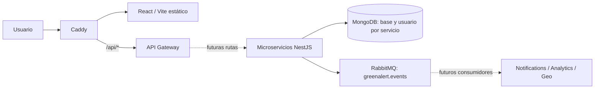

# Green Alert 2.0

Base de una plataforma para reportar y gestionar incidentes ambientales. Este corte implementa **únicamente las etapas 1, 2 y 3**: monorepo NestJS, librerías compartidas e infraestructura. Los ocho procesos arrancan con endpoints de salud; los módulos de dominio son esqueletos sin operaciones funcionales.

## Requisitos y ejecución

- Node.js 22 LTS con npm 10 o superior.
- Docker Engine / Docker Desktop con contenedores Linux y Docker Compose v2.
- Para desarrollo en Windows, preferir una carpeta local fuera de Google Drive: las instalaciones con miles de archivos pueden fallar en unidades sincronizadas.

```sh
npm ci
node scripts/init-env.mjs
npm run build
npm run lint
npm test
npm run test:integration
docker compose config --quiet
docker compose up --build -d --wait --wait-timeout 300
```

El generador crea `.env` con secretos aleatorios locales y no sobrescribe uno existente. No copiar primero `.env.example` si se utiliza el generador. No subir `.env` ni claves a Git.

- Frontend: http://localhost:8080
- Salud del gateway: http://localhost:8080/api/v1/health
- Salud interna: `http://<servicio>:3001..3007/health`, según el servicio.
- RabbitMQ Management, opcional en desarrollo:
  `docker compose -f docker-compose.yml -f docker-compose.dev.yml up -d`.
  Abrir http://localhost:15672 con las credenciales locales de `.env`.
- Swagger y endpoints funcionales: **pendientes de la etapa 4**. No existe todavía `/api/docs`.

`docker compose down` detiene el entorno y conserva los volúmenes. No usar `down -v` salvo que se quiera eliminar los datos.

## Arquitectura

NestJS 11 + TypeScript estricto, React 19 + Vite, Mongoose, MongoDB, RabbitMQ, Docker y Caddy. Hay un monorepo de aplicaciones Nest y un workspace npm para el frontend, con un único lockfile. Nest compila cada aplicación con webpack y resuelve los alias `@app/*` también en los artefactos ejecutables.



Las flechas discontinuas representan integración de negocio todavía pendiente. El gateway solo publica su salud. Los servicios conectan a su propia base y al broker al arrancar. La salud HTTP es **liveness**, no comprueba continuamente dependencias; un proceso puede seguir sano en HTTP durante una reconexión.

## Estructura

```text
apps/
  api-gateway/src/{main.ts,app.module.ts}
  auth-service/src/modules/auth/
  users-service/src/modules/users/
  reports-service/src/modules/{reports,categories,assignments}/
  geo-service/src/modules/geo/
  evidence-service/src/modules/evidence/
  notifications-service/src/modules/notifications/
  analytics-service/src/modules/analytics/
  frontend/{src,Dockerfile,Caddyfile,vite.config.ts}
libs/
  common/{constants,decorators,enums,exceptions,interfaces,utils}/
  config/
  contracts/{users,reports,events}/
  database/
  messaging/
  security/
infrastructure/
  caddy/Caddyfile
  mongodb/init-users.js
  rabbitmq/rabbitmq.conf
scripts/
  build.mjs
  init-env.mjs
test/
docs/
.github/workflows/
.vscode/
```

Cada servicio Nest incluye `main.ts`, `app.module.ts` y `tsconfig.app.json`. No se duplican carpetas common/database/events vacías: los componentes compartidos están en libs; las carpetas de cada servicio se agregarán cuando exista código propio. `dist/` y `node_modules/` son generados, no versionados.

## Librerías

- **common**: roles y estados, prefijo de API, usuario autenticado, decorador, validación HTTP, Helmet, filtro que oculta errores internos y módulo de salud.
- **config**: `@nestjs/config`, validación de entorno y puerto, selección de URI por servicio.
- **contracts**: vistas mínimas de usuarios/reportes y eventos versionados con id y correlationId. No comparte schemas Mongoose ni contraseñas; las categorías usan identificadores, no un enum fijo.
- **database**: módulo Mongoose reutilizable; no expone modelos de negocio.
- **messaging**: exchange topic durable, publicación persistente con confirmación, reconexión, prefetch, ack manual y dead-letter por consumidor. Ver [decisiones](docs/architecture.md).
- **security**: JwtGuard, RolesGuard, @Roles y hash bcrypt. Son componentes disponibles para etapas posteriores, no autenticación ya activa. El módulo JWT valida secreto mínimo y limita algoritmo, emisor y audiencia; TTL de acceso base: 900 segundos.

## MongoDB

Un servidor, siete bases: `greenalert_auth`, `greenalert_users`, `greenalert_reports`, `greenalert_geo`, `greenalert_evidence`, `greenalert_notifications` y `greenalert_analytics`.

El script de inicialización crea usuarios con permiso readWrite solo en su base. Ningún servicio recibe credenciales root. Solo corre con un volumen vacío; cambiar contraseñas en `.env` no rota usuarios existentes. Para rotación se requiere actualizar el usuario en MongoDB y luego la configuración. Los esquemas, índices y migraciones de dominio se implementarán en sus etapas.

## Docker y Caddy

`docker-compose.yml` incluye los 12 servicios, red `green-alert-network`, volúmenes persistentes y healthchecks. Solo Caddy publica puertos, ligados a loopback por defecto. MongoDB y los servicios internos no tienen puertos del host. El panel RabbitMQ solo se publica mediante el archivo de desarrollo.

El Dockerfile backend usa etapas de build y dependencias, y ejecuta Node con usuario sin privilegios. Cada servicio selecciona su bundle mediante `APP_NAME`. El frontend se construye con Vite y un Caddy interno sirve sus archivos; Caddy de entrada es el único reverse proxy. No se usa Nginx.

Los puertos internos de Compose son fijos para mantener consistencia con el proxy y los healthchecks. Las variables `*_PORT` de `.env` se usan al ejecutar procesos directamente; no cambian el mapeo interno de Compose.

## Desarrollo y producción

`npm run start:dev` inicia el esqueleto del gateway. Para otro proceso: `npx nest start reports-service --watch`, con MongoDB y RabbitMQ accesibles y sus URI configuradas. Las URI del archivo generado utilizan DNS de Docker y no funcionan directamente desde el host. El frontend integrado se verifica mediante Compose.

Para preparar el mismo Compose en un servidor con dominio válido, crear un archivo de entorno privado con:
```dotenv
NODE_ENV=production
BIND_ADDRESS=0.0.0.0
HTTP_PORT=80
HTTPS_PORT=443
CADDY_SITE=alertas.tudominio.com
```
Incluir también todas las credenciales y URI necesarias. Ejecutar `docker compose --env-file .env.production up --build -d`, sin el override de desarrollo. Con DNS apuntando al servidor y puertos 80/443 accesibles, Caddy gestiona TLS y la redirección HTTP a HTTPS. Los volúmenes caddy_data/caddy_config conservan certificados y estado.

Esto prepara el despliegue de infraestructura; no convierte el esqueleto en un producto terminado. CORS explícito, rate limiting, Swagger y enrutamiento están pendientes del gateway; registro, login, refresh y logout están pendientes de Auth. Las variables de refresh y TTL se reservan para esa etapa.

## Verificación y alcance pendiente

Consultar [validación](docs/validation.md) para los resultados del entorno de implementación. CI instala desde el lockfile, compila, ejecuta lint y pruebas, valida Compose e intenta levantar todos los contenedores. Las pruebas de Auth/Reports de negocio corresponden a sus etapas futuras; ahora se prueban configuración, seguridad, mensajería y salud HTTP.

El README anterior solo contenía «hola» y se reemplazó con esta documentación. No había módulos, DTOs, schemas ni lógica que preservar.
